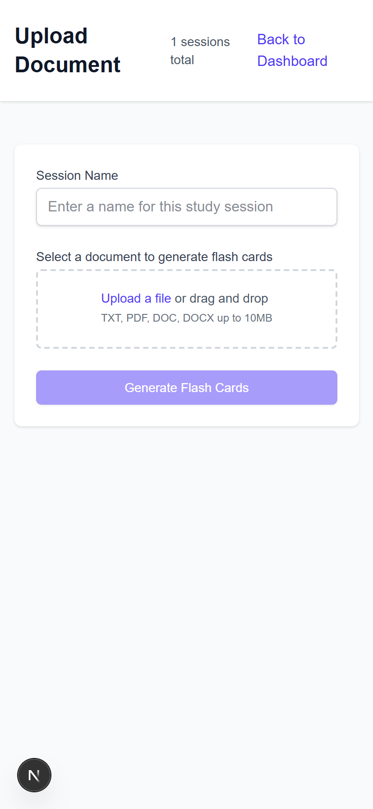
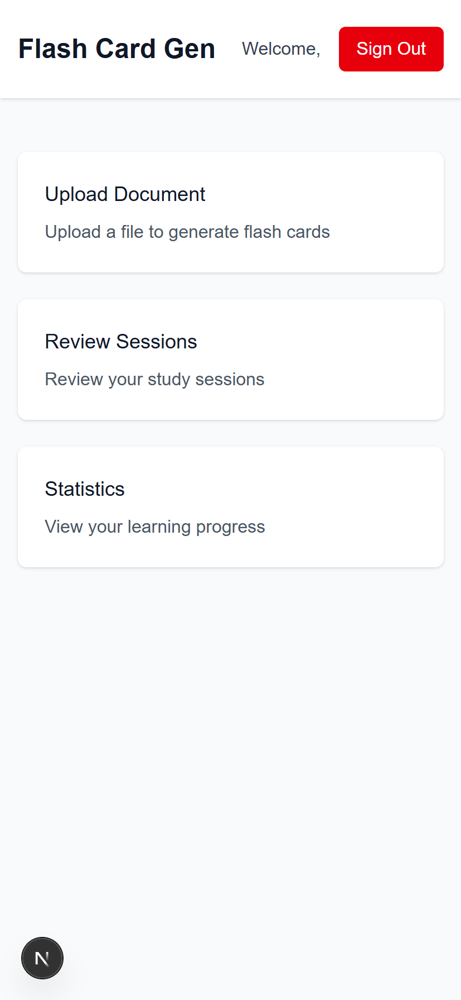
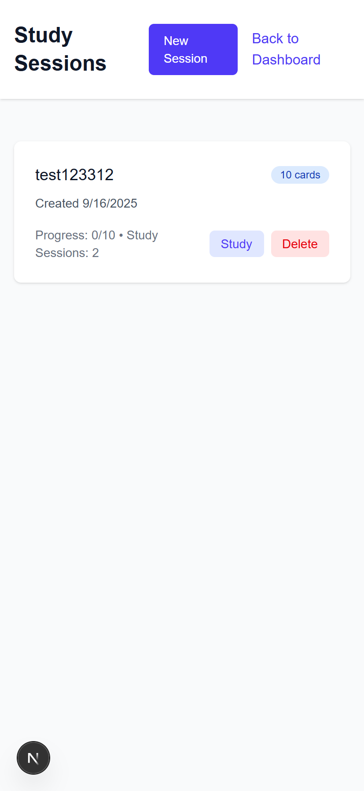
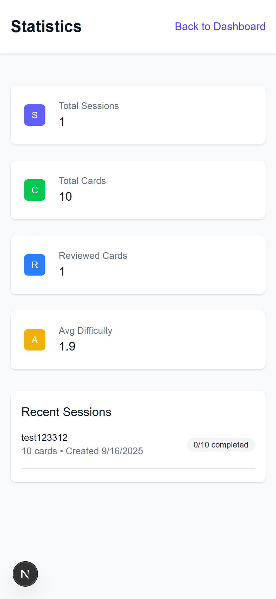
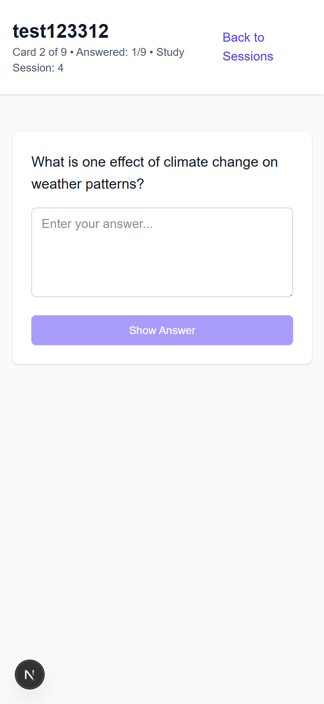
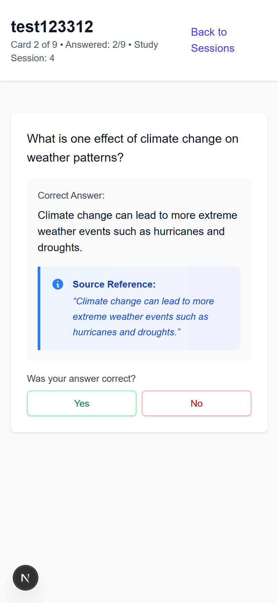

# Flash Card Generator

An AI-powered flash card generation and review system built with Next.js.

## Features

- AI-generated flash cards from uploaded documents
- OAuth authentication (GitHub, Facebook, Google)
- Spaced repetition learning system
- Local storage for offline use
- Progress tracking and statistics
- Difficulty-based card scheduling

## Screenshots

| | | |
|---|---|---|
|  |  |  |
|  |  |  |

## Getting Started

### Development Mode (No Auth)

By default, the app runs in development mode without authentication:

```bash
npm run dev
```

### Development Mode with Auth

To run with authentication enabled in development:

```bash
FORCE_AUTH=true npm run dev
```

### Environment Variables

Create a `.env.local` file with your OAuth credentials:

```env
# NextAuth
NEXTAUTH_SECRET=your-secret-key-here
NEXTAUTH_URL=http://localhost:3000

# GitHub OAuth
GITHUB_CLIENT_ID=your-github-client-id
GITHUB_CLIENT_SECRET=your-github-client-secret

# Facebook OAuth
FACEBOOK_CLIENT_ID=your-facebook-client-id
FACEBOOK_CLIENT_SECRET=your-facebook-client-secret

# Google OAuth
GOOGLE_CLIENT_ID=your-google-client-id
GOOGLE_CLIENT_SECRET=your-google-client-secret

# OpenAI
OPENAI_API_KEY=your-openai-api-key
```

## Usage

1. Upload a document (TXT, PDF, DOCX)
2. AI generates 20-25 flash cards
3. Review cards and rate difficulty
4. Cards are scheduled using spaced repetition
5. Track your progress in statistics

## Tech Stack

- **Frontend**: Next.js 15, React 19, TypeScript, Tailwind CSS
- **Authentication**: NextAuth.js
- **AI**: OpenAI API
- **Storage**: LocalStorage (client-side)
- **File Processing**: Support for text, PDF, and DOCX files
